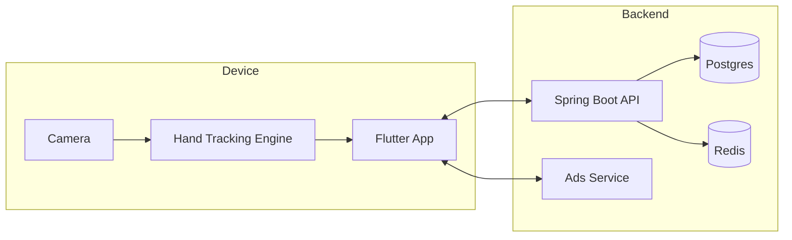

# Architecture

## High-level
- **Apps**
  - Mobile (Flutter): creation experience + export + optional ads
  - Web (React): admin/dashboard + demo hosting
- **Services**
  - API (Spring Boot): auth, profiles, projects, exports metadata, analytics
  - Ads service (Node): privacy-aware ad configuration & consent orchestration
- **ML**
  - Python R&D: experiments, evaluation, export pipelines
  - Mobile inference: TFLite/CoreML via platform plugin (on-device)

## Rule
Camera frames and biometric-like data must **not** be uploaded by default.

